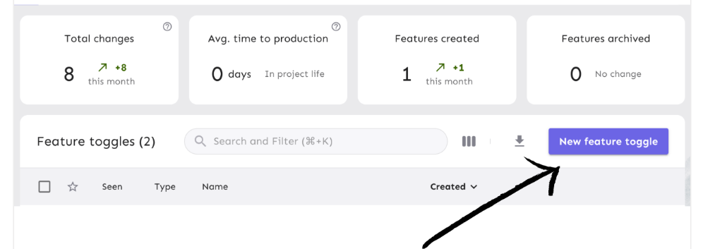
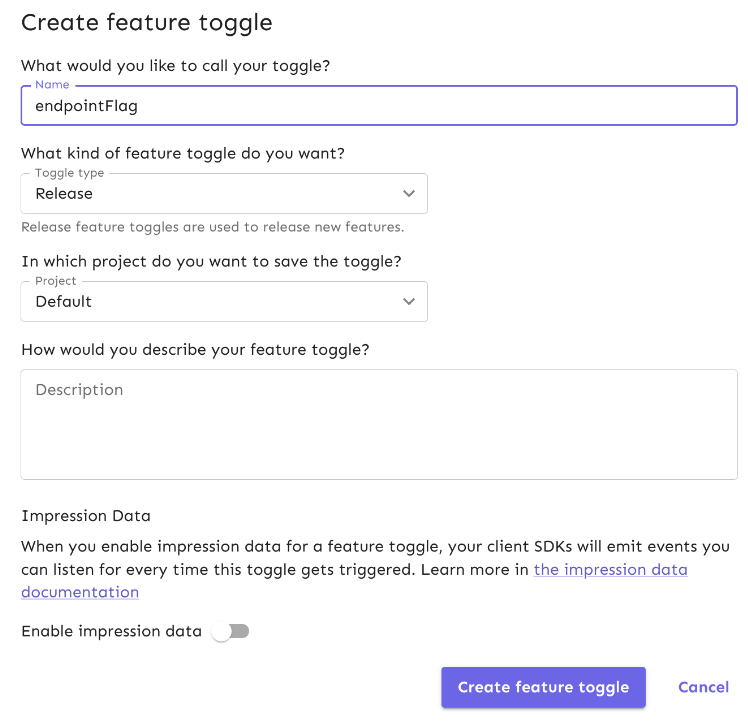
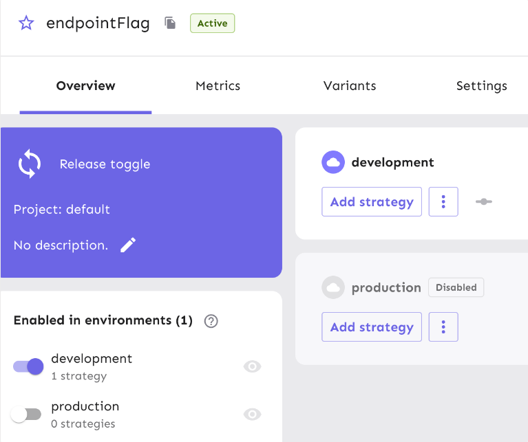
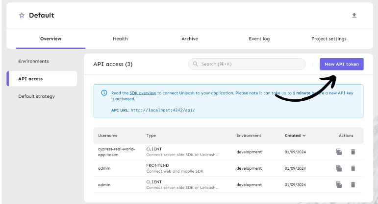
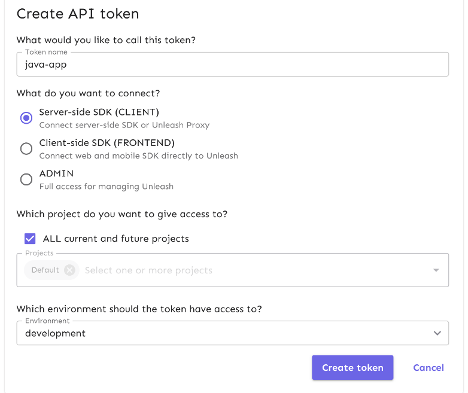
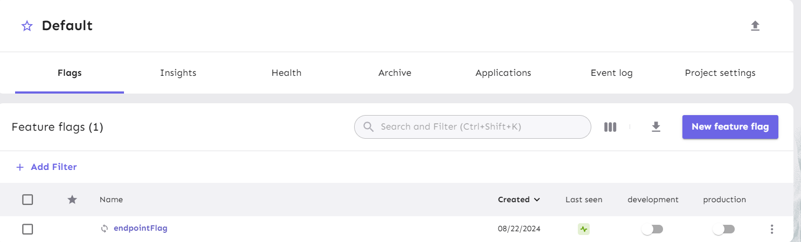

git clone https://github.com/Unleash/unleash.git
cd unleash
docker compose up -d

#username and password for login
Username: admin
Password: unleash4all

When we turn on and off the feature flag that time no need to restart out applcaiton it will take effect after some time